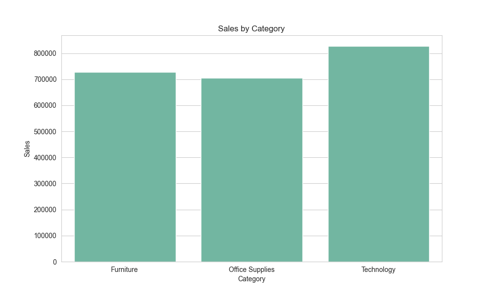
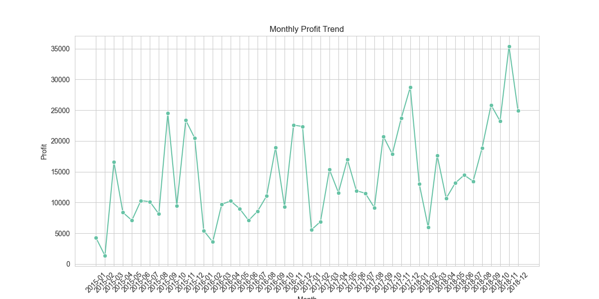
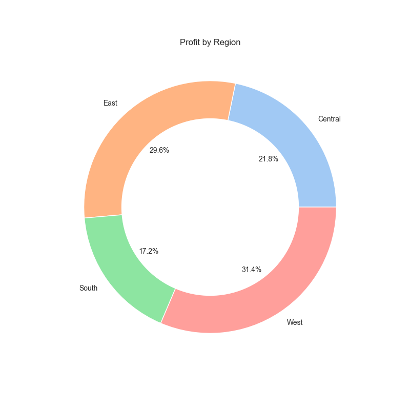

# R2R-Financial-Analysis
# 📊 Financial Data Analysis using R2R Process

## 🔍 Description
This project simulates the Record-to-Report (R2R) process using Python and a sales dataset to perform financial analysis and reporting.

## 🚀 Features
- Data Cleaning & Validation  
- Expense & Profit Calculation  
- Monthly Sales & Profit Analysis  
- Category & Region Analysis  
- Customer Insights  
- Data Visualization  

## 🛠 Tech Stack
- Python  
- Pandas  
- Matplotlib  
- Seaborn  
- Jupyter Notebook  

## 📈 Sample Outputs

## 📂 Project Structure
